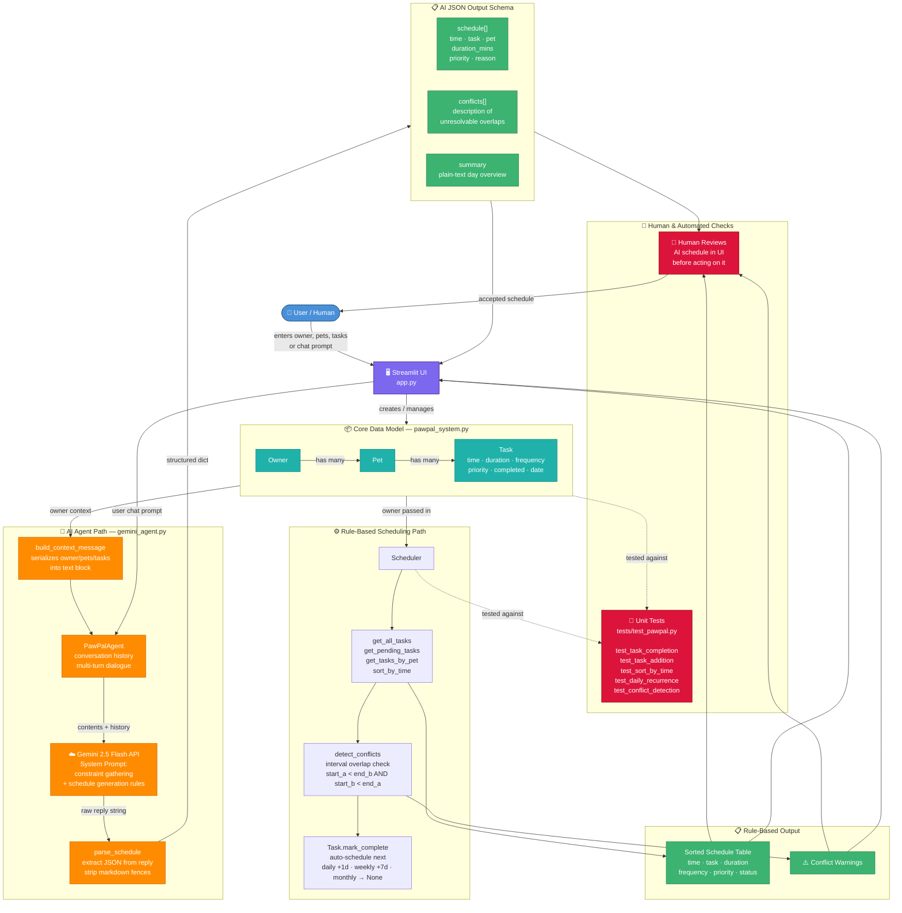

# PawPal+ System Architecture



## Component Breakdown

### Data Flow Summary

1. **User** enters owner, pets, tasks, or chat prompts via the **Streamlit UI**
2. The UI creates/manages the **Core Data Model** (`Owner → Pet → Task`)
3. The model feeds into either the **Rule-Based** or **AI Agent** path

### Rule-Based Path

- `Scheduler` retrieves and sorts tasks, then `detect_conflicts` runs an interval overlap check
- `Task.mark_complete()` auto-generates the next recurring task

### AI Agent Path

- `build_context_message` serializes all owner/pet/task state into text
- `PawPalAgent` maintains multi-turn history and sends it to **Gemini 2.5 Flash**
- The reply is parsed into a structured JSON schema (`schedule[]`, `conflicts[]`, `summary`)

### Human & Testing Checkpoints

- A human reviews the AI-generated schedule in the UI before acting on it
- Automated unit tests (`tests/test_pawpal.py`) validate the data model and scheduler independently

### Output Schemas

**Rule-Based Output**
| Column | Description |
|--------|-------------|
| Time | Scheduled time (12-hour format) |
| Task | Description |
| Duration | Minutes required |
| Frequency | daily / weekly / monthly |
| Priority | high / medium / low |
| Status | ✅ complete / ⏳ pending |

**AI JSON Output**
```json
{
  "schedule": [
    {
      "time": "08:00 AM",
      "task": "Morning walk",
      "pet": "Buddy",
      "duration_mins": 30,
      "priority": "high",
      "reason": "Moved from 7:00 AM to avoid overlap with feeding"
    }
  ],
  "conflicts": [],
  "summary": "Plain-text overview of the day"
}
```
